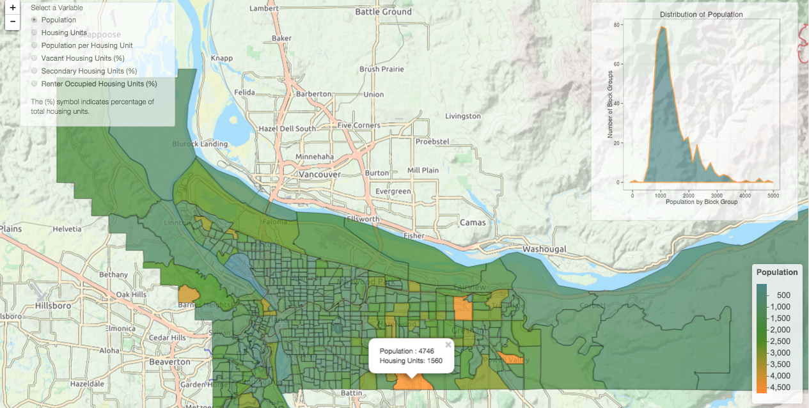

# PDX Census App

Visualizing housing data in Portland, with data from the 2010 US Census. 
This `R` application was built using the `leaflet`, `shiny`, and `ggplot` packages. 
See it run here: https://miguelconner4.shinyapps.io/PDX_Census. 

